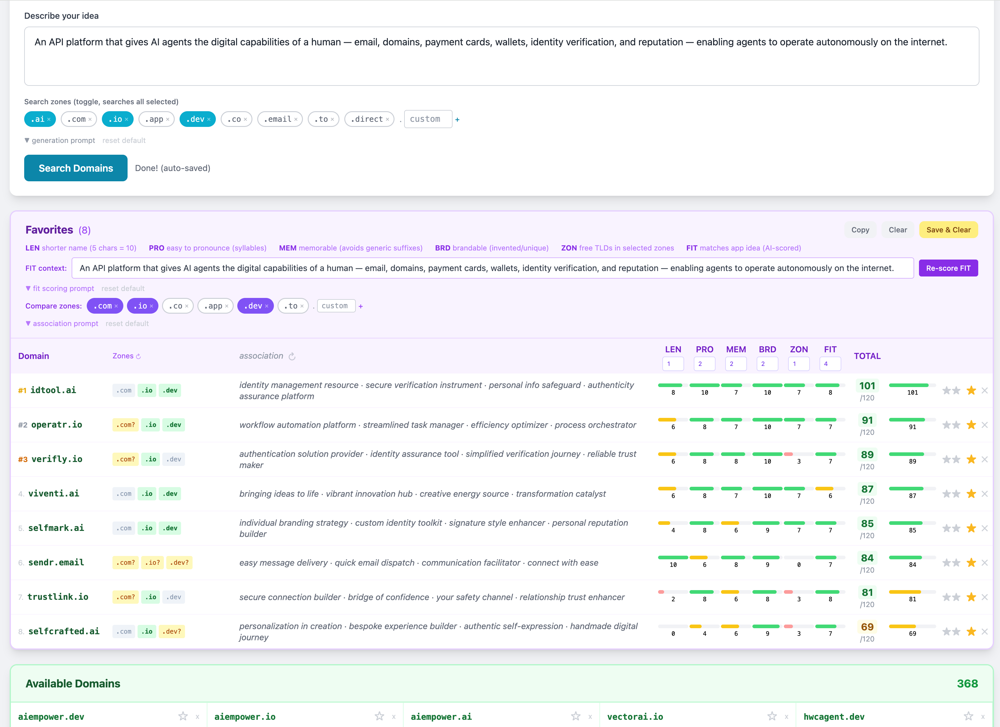

# Startup Domain Search

[](https://domainsearcher.app)
[](https://github.com/vasilytrofimchuk/domainsearcher-app/stargazers)
[](LICENSE)
[](https://console.groq.com)

**Score and choose the best domain name for your startup — not just generate and check.**

Describe your startup idea → get 60 creative domain name candidates → check real-time availability across the TLDs you care about → score each name on Length, Pronounceability, Memorability, Brandability, Zone availability, and AI Fit → pick the winner with confidence.

**Live site:** https://domainsearcher.app



## What it does

Most domain tools stop at availability. This one helps you **decide**. Every candidate is scored across six dimensions, weighted by you, so you can rank names objectively:

| Score | What it measures | How |
|-------|-----------------|-----|
| **LEN** | Length — 5 chars = perfect 10 | Computed |
| **PRO** | Pronounceability — flows naturally out loud | AI-scored |
| **MEM** | Memorability — would someone remember it tomorrow? | AI-scored |
| **BRD** | Brandability — unique, ownable, not generic | AI-scored |
| **ZON** | Zone score — fraction of your TLDs that are available | Computed |
| **FIT** | How well the name evokes your specific app idea | AI-scored |

PRO, MEM, BRD, and FIT are all scored in a **single AI call** once you enter an app description. LEN and ZON are instant local computation. Weights are adjustable per dimension.

## Availability checking

Two-stage check per domain — catches false negatives from unreliable registries (.io, .ai, .co):

1. **RDAP** (rdap.org) — registry lookup: 200 = taken, 404 = unconfirmed
2. **DNS-over-HTTPS** (Cloudflare 1.1.1.1) — A-record lookup: NXDOMAIN = available, NS/SOA in Authority = taken

Both are CORS-enabled — runs entirely in the browser, no proxy needed.

## Run locally

No build step. Serve the repo root over HTTP:

```bash
npx serve .
# or
python3 -m http.server 8080
```

Open http://localhost:8080. Must use an HTTP server (not `file://`) for ES modules to work.

## How to use

1. **Type your startup idea** in the description box
2. **Select TLDs** — toggle .ai, .com, .io, .app, .dev, etc.
3. **Click "Search Domains"** — names stream in as each is checked
4. **Star ★ domains** you like — they appear in the Favorites scoring panel
5. **Enter your app description** and click "Score AI" — PRO, MEM, BRD, FIT all update in one call
6. **Adjust weights** to match your priorities (FIT=5 by default, others=1–2)
7. **Quick Check** — type any single domain stem to check synonyms + all zones instantly
8. **Save & Clear** — snapshot a favorite set and restore later

## AI word-associations

Each favorited domain gets 3 word-associations that reflect both the name stem and its TLD meaning (.ai = artificial intelligence, .io = developer tool, etc.). Click ↻ next to "association" to refresh with any custom prompt.

## API key

The tool ships with a bundled Groq key (free tier, no setup needed).

To use your own key or switch providers, paste it in the **AI provider** row at the top of the search form. Keys are stored in your browser's localStorage only.

| Provider | Key prefix | Where to get |
|----------|-----------|-------------|
| Groq (recommended) | `gsk_` | https://console.groq.com |
| OpenAI | `sk-` | https://platform.openai.com |
| Anthropic/Claude | `sk-ant-` | https://console.anthropic.com |

## Tech

- Static HTML + vanilla JS (ES modules), no build step
- [rdap.org](https://rdap.org) + Cloudflare DoH for two-stage domain availability
- [Groq](https://console.groq.com) / OpenAI / Anthropic for AI generation and scoring
- localStorage for all persistence (no backend, no account)
- GitHub Pages for hosting
